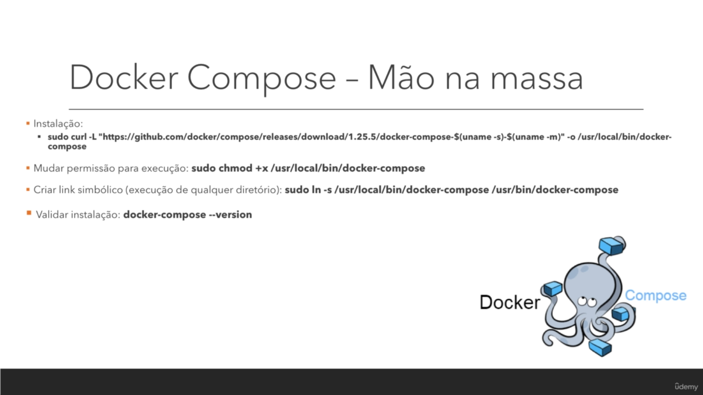

# devops-mao-na-massa

### Esse MD Será melhorado em breve

### Instalar o VBGuest

vagrant plugin install vagrant-vbguest --plugin-version 0.21

### Intalar nfs no windows

vagrant plugin install vagrant-winnfsd

### Comandos 


**Sobe a máquina**: vagrant up

**Destroi a máquina**: vagrant destroy

**acessar**: vagrant ssh

**Copiar**

vagrant upload node-app /tmp/

diretório da máquina virtual que sincroniza tudo que estiver na raiz do vagrant file

cd /vagrant

### Git

init

status
add
commit

add origin
push
pull

branch
merge

### Ansible
app01 - VM aplicativo Java
db01 - VM banco de dados
control-node - terá o ansible instalado

### Docker

```sh
# Criar a rede para os containers se comunicarem
docker network create devops

# Listar rede
docker network ls

# Ver containers que estão rodando
docker ps

# Ver todos os containers
docker ps -a

# Apagar Container
docker rm -f nome_ou_3_primeiros_digitos

# Iniciando a imagem redis na rede
docker run --net devops --name redis-server -d redis

#verificar se está rodando
docker logs -f redis-server

# rodando o node na rede redis
docker run --net devops -p 8080:8081 devops/node-app

# rodando o node na rede redis em background
docker run --net devops -p 8080:8081 -d devops/node-app

# Testando conexão
curl http://localhost:8080/

# Instanciando um Ubuntu com pasta montada, e 
# modo interativo, quando sai do terminal a instancia morre
docker run -i -t -v /vagrant/upload-images:/upload-images ubuntu:16.04

```




```sh
# Instalação e verificação do docker compose
sudo curl -L "https://github.com/docker/compose/releases/download/1.25.5/docker-compose-$(uname -s)-$(uname -m)" -o /usr/local/bin/docker-compose
sudo chmod +x /usr/local/bin/docker-compose
sudo ln -s /usr/local/bin/docker-compose /usr/bin/docker-compose
docker-compose --version

sudo curl -L "https://github.com/docker/compose/releases/download/1.25.5/docker-compose-$(uname -s)-$(uname -m)" -o /usr/local/bin/docker-compose

# limpar todas as instancias do docker
docker system prune
docker volume prune
docker network rm devops

# Para rodar o docker compose
docker-compose up

# ele cria uma rede automaticamente para a comunicção entre o redis e o app nodeJS
docker network ls 

# Parar as instancias e limpar, não deixa containers
docker-compose down

# Para rodar em background
docker-compose up -d


```
  